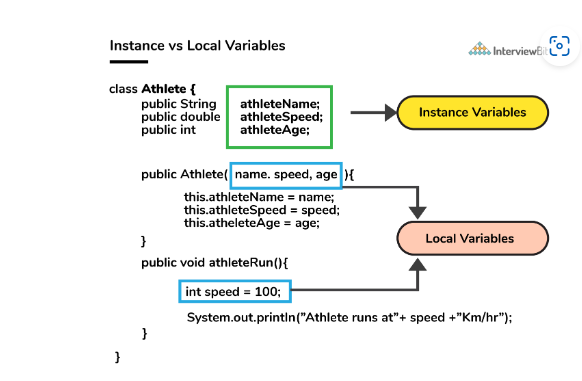

# Mock1 (1)

# Java
### 1. What do you understand by an instance variable and a local variable?

**Instance variables** are those variables that are accessible by all the methods in the class. They are declared outside the methods and inside the class. These variables describe the properties of an object and remain bound to it at any cost.

All the objects of the class will have their copy of the variables for utilization. If any modification is done on these variables, then only that instance will be impacted by it, and all other class instances continue to remain unaffected.

**Local variables** are those variables present within a block, function, or constructor and can be accessed only inside them. The utilization of the variable is restricted to the block scope. Whenever a local variable is declared inside a method, the other class methods don’t have any knowledge about the local variable.



### 2. **What do you mean by data encapsulation?**

- Data Encapsulation is an Object-Oriented Programming concept of hiding the data attributes and their behaviours in a single unit.
- It helps developers to follow modularity while developing software by ensuring that each object is independent of other objects by having its own methods, attributes, and functionalities.
- It is used for the security of the private properties of an object and hence serves the purpose of data hiding.


### 3. State the output

```jsx
String str1 = "InterviewBit";
String str2 = "InterviewBit";
 
System.out.println(str1 == str2);

String str1 = new String("InterviewBit");
String str2 = "InterviewBit";
 
System.out.println(str1 == str2);

System.out.println(str1.equals(str2));
```

true false true

### **4. Why is the main method static in Java?**

The main method is always static because static members are those methods that belong to the classes, not to an individual object. So if the main method will not be static then for every object, It is available. And that is not acceptable by JVM. JVM calls the main method based on the class name itself. Not by creating the object.

Because there must be only 1 main method in the java program as the execution starts from the main method. So for this reason the main method is static

## 5.****what are the reasons behind making strings immutable in Java?****

A String is made immutable due to the following reasons:

- **String Pool:** Designers of Java were aware of the fact that String data type is going to be majorly used by the programmers and developers. Thus, they wanted optimization from the beginning. They came up with the notion of using the String pool (a storage area in Java heap) to store the String literals. They intended to decrease the temporary String object with the help of sharing. An immutable class is needed to facilitate sharing. The sharing of the mutable structures between two unknown parties is not possible. Thus, immutable Java String helps in executing the concept of String Pool.


**(Why str4 is not pooled?**

- **[Multithreading](https://www.interviewbit.com/multithreading-interview-questions/):** The safety of threads regarding the String objects is an important aspect in Java. No external synchronization is required if the String objects are immutable. Thus, a cleaner code can be written for sharing the String objects across different threads. The complex process of concurrency is facilitated by this method.
- **[Collections](https://www.interviewbit.com/java-collections-interview-questions/):** In the case of Hashtables and HashMaps, keys are String objects. If the String objects are not immutable, then it can get modified during the period when it resides in the HashMaps. Consequently, the retrieval of the desired data is not possible. Such changing states pose a lot of risks. Therefore, it is quite safe to make the string immutable

# **Docker:**

6.****Differentiate between virtualization and containerization.****

The question indirectly translates to explaining the difference between virtual machines and Docker containers.

| Virtualization | Containerization |
| --- | --- |
| This helps developers to run and host multiple OS on the hardware of a single physical server. | This helps developers to deploy multiple applications using the same operating system on a single virtual machine or server. |
| Hypervisors provide overall virtual machines to the guest operating systems. | Containers ensure isolated environment/ user spaces are provided for running the applications. Any changes done within the container do not reflect on the host or other containers of the same host. |
| These virtual machines form an abstraction of the system hardware layer this means that each virtual machine on the host acts like a physical machine. | Containers form abstraction of the application layer which means that each container constitutes a different application. |

7****. What are docker images?****

They are executable packages(bundled with application code & dependencies, software packages, etc.) for the purpose of creating containers. Docker images can be deployed to any docker environment and the containers can be spun up there to run the application

8.****Can you tell something about docker container?****

- In simplest terms, docker containers consist of applications and all their dependencies.
- They share the kernel and system resources with other containers and run as isolated systems in the host operating system.
- The main aim of docker containers is to get rid of the infrastructure dependency while deploying and running applications. This means that any containerized application can run on any platform irrespective of the infrastructure being used beneath.
- Technically, they are just the runtime instances of docker images.

# OS

9.****What is virtual memory?****

It is a memory management technique feature of OS that creates the illusion to users of a very large (main) memory. It is simply space where a greater number of programs can be stored by themselves in the form of pages. It enables us to increase the use of physical memory by using a disk and also allows us to have memory protection. It can be managed in two common ways by OS i.e., [paging and segmentation](https://www.scaler.com/topics/difference-between-paging-and-segmentation/). It acts as temporary storage that can be used along with RAM for computer processes.


10.****What is difference between process and thread?****

**Process:** It is basically a program that is currently under execution by one or more threads. It is a very important part of the modern-day OS.

**Thread:** It is a path of execution that is composed of the program counter, thread id, stack, and set of registers within the process.


| Process | Thread |
| --- | --- |
| It is a computer program that is under execution. | It is the component or entity of the process that is the smallest execution unit. |
| These are heavy-weight operators. | These are lightweight operators. |
| It has its own memory space. | It uses the memory of the process they belong to. |
| It is more difficult to create a process as compared to creating a thread. | It is easier to create a thread as compared to creating a process. |
| It requires more resources as compared to thread. | It requires fewer resources as compared to processes. |
| It takes more time to create and terminate a process as compared to a thread. | It takes less time to create and terminate a thread as compared to a process. |
| It usually run-in separate memory space. | It usually run-in shared memory space. |
| It does not share data. | It shares data with each other. |
| It can be divided into multiple threads. | It can’t be further subdivided. |