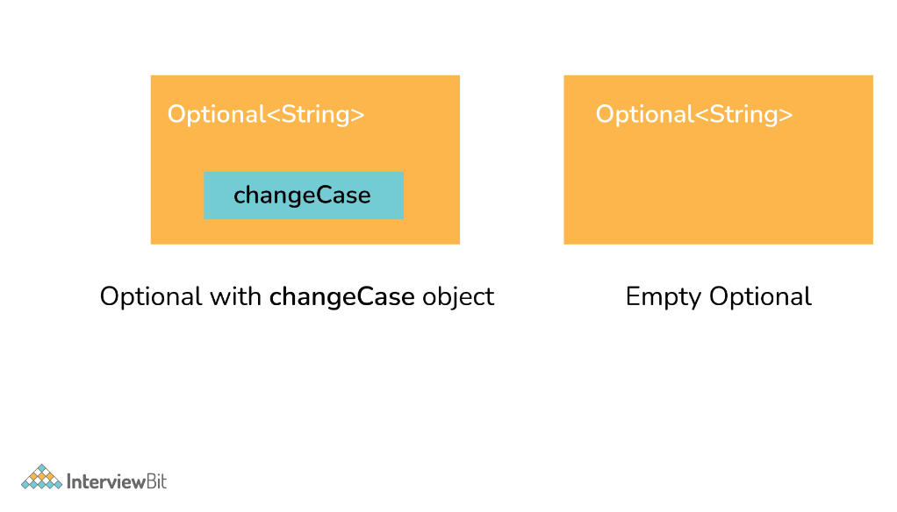

# 12.11

# Java8 & Linux

### 1. Tell me about ****lambda expression in Java8****

```java
FunctionalInterface fi = (String name) -> {
System.out.println("Hello "+name);
return "Hello "+name;
}
```

Lambda expression can be divided into three distinct parts as below:

1. List of Arguments/Params:

(String name)

A list of params is passed in () round brackets. It can have zero or more params. Declaring the type of parameter is optional and can be inferred for the context.

2. Arrow Token: ->

Arrow token is known as the lambda arrow operator. It is used to separate the parameters from the body, or it points the list of arguments to the body. 

3. Expression/Body:

```java
{
System.out.println("Hello "+name);
return "Hello "+name;
}
```

A body can have expressions or statements. {} curly braces are only required when there is more than one line. In one statement, the return type is the same as the return type of the statement. In other cases, the return type is either inferred by the return keyword or void if nothing is returned.

### 2. What is an optional class

Optional is a container type which may or may not contain value i.e. zero(null) or one(not-null) value. It is part of java.util package. There are pre-defined methods like isPresent(), which returns true if the value is present or else false and the method get(), which will return the value if it is present.

```java
static Optional<String>changeCase(String word) {
    if (name !=null && word.startsWith("A")) {
        return Optional.of(word.toUpperCase());
    }
    else {
        return Optional.ofNullable(word); // someString can be null
    }
}
```



The Optional class is a container object that may or may not contain a non-null value. It provides methods to perform operations on the value if it is present, or to handle the absence of a value in a more structured way.

Here's a brief overview of some key features and methods of the Optional class:

1. Creation of Optional:
    - You can create an Optional instance using static methods like `of`, `ofNullable`, or `empty`.
    - `of` method is used when you are sure that the value will be non-null.
    - `ofNullable` method is used when the value can be null.
    - `empty` method creates an empty Optional.
2. Accessing the Value:
    - Methods like `get`, `orElse`, `orElseGet`, and `orElseThrow` are used to access the value from the Optional.
    - These methods provide different ways to handle the absence of a value, either by providing a default value or throwing an exception.
3. Conditional Operations:
    - Optional provides methods like `isPresent`, `ifPresent`, and `filter` to perform conditional operations on the value if it is present.
4. Transformation and Mapping:
    - Methods like `map`, `flatMap`, and `ifPresentOrElse` are used to transform the value or perform specific actions based on its presence or absence.
5. Chaining Operations:
    - Optional supports method chaining to perform sequential operations on the value in a concise manner.

Using the Optional class can lead to more readable and robust code by clearly expressing the presence or absence of a value and handling each case appropriately.

### 3. What are Java8 Streams

A stream is an abstraction to express data processing queries in a declarative way.

A Stream, which represents a sequence of data objects & series of operations on that data is a data pipeline that is not related to Java I/O Streams does not hold any data permanently.

The key interface is `java.util.stream.Stream<T>`. It accepts Functional Interfaces so that lambdas can be passed. Streams support a fluent interface or chaining. Below is the basic stream timeline marble diagram:


### 4. State 5 process states in Linux and their relations


- **New/Ready:** In this state, a new process is created and is ready to run.
- **Running:** In this state, the process is being executed.
- **Blocked/Wait:** In this state, the process is waiting for input from the user and if doesn't have resources to run such as memory, file locks, input, then it can remain in a waiting or blocked state.
- **Terminated/Completed:** In this state, the process has completed the execution or terminated by the OS.
- **Zombie:** In this state, the process is terminated but information regarding the process still exists and is available in the process table.

### 5. ****Name three standard streams in Linux.****


1. Standard Input (stdin)
2. Standard Output (stdout)
3. Standard Error (stderr)